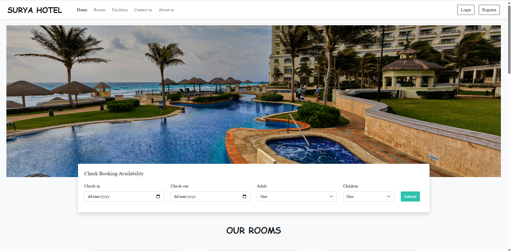
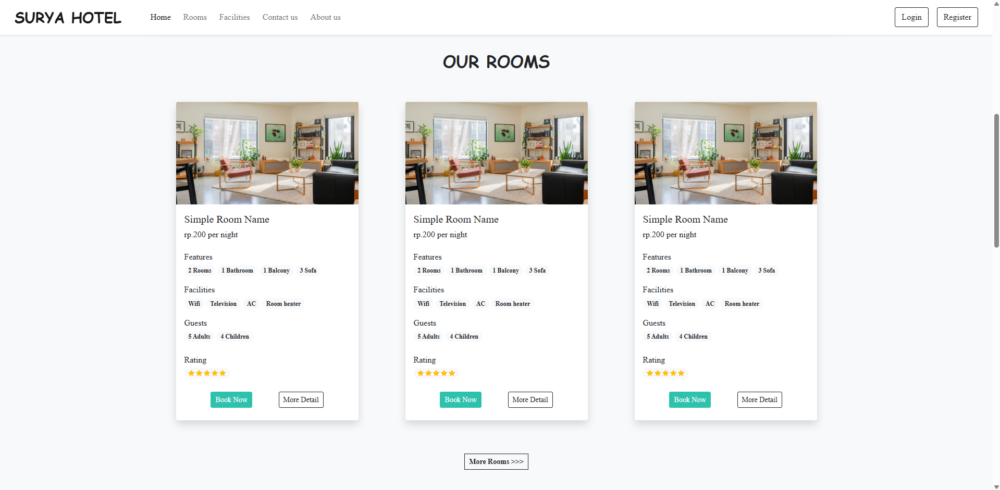
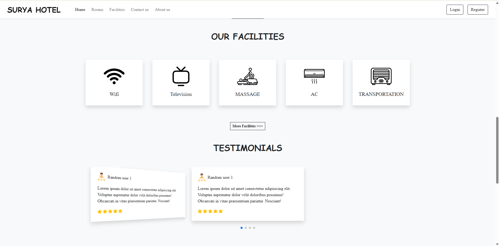
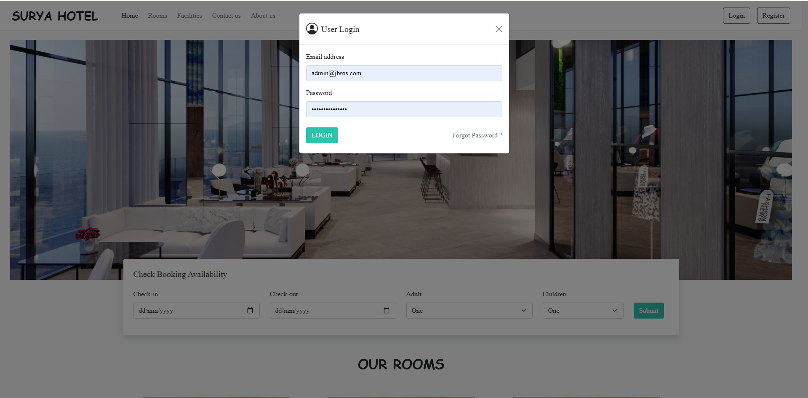
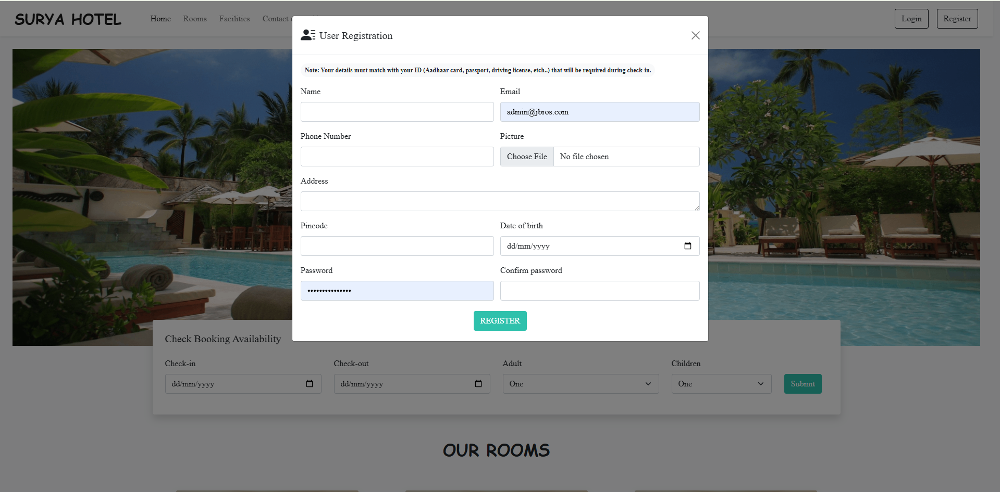
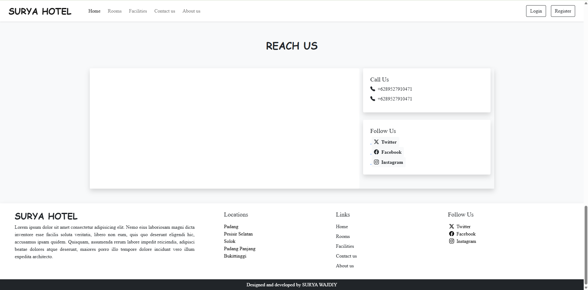

# UI Website Hotel

A hotel website built using PHP, HTML, CSS, JavaScript, and MySQL.

## Preview

## About

UI Website Hotel is a hotel website designed to present hotel information in a professional, responsive, and user-friendly interface.

The website provides information about the hotel, facilities, rooms, and contact page to deliver a better user experience.

## Features

- Homepage
- About Hotel
- Hotel Facilities
- Room Information
- Contact Page
- Admin Dashboard
- Login & Register
- Responsive Design

## Technologies

- PHP
- HTML5
- CSS3
- JavaScript
- MySQL

## Screenshots

### Homepage

### Homepage Section

### Homepage Section

### Login

### Register

### Footer

